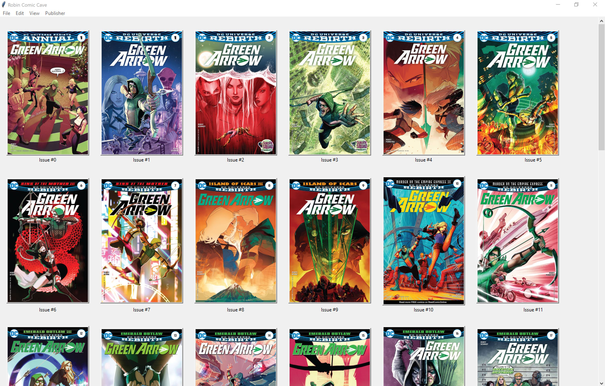

# Comic Library
This project serves as a comic book library as well as reader. 
It can read files of various formats (including ZIP, CBR, and CBZ)

## Usage

Once the program has been started to user will be taken to this main menu. This menu will list all titles in the users library.

By clicking on a title the user will then be shown all issues related to that title.

Upon selecting an issue a pop up window will appear, allowing the user to read the issue. Flipping pages is as simple as just clicking the image of a page.

This program supports the addition of issues to the library either through the import of an archive file (zip, rar, cbr, cbz) or by giving the location of a folder holding the pages.

This library also has a Story Arc function which allows the user to see all the story arcs to date for their favorite publisher. The Story arcs are separated by publishing era. Upon selecting a story arc the user will be shown all issues, in order, for this chosen story arc. From this page the user will also have the option to begin reading issues pertaining to the specific arc (to be implemented).

